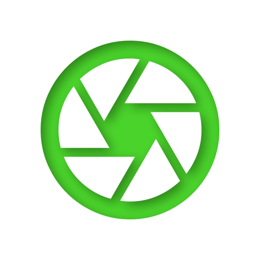
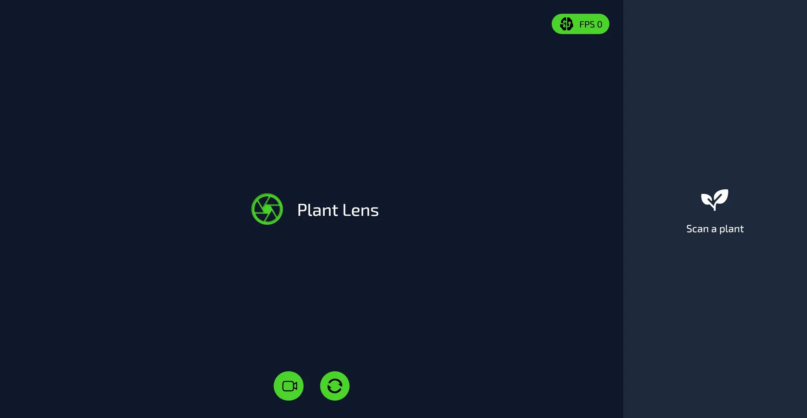

  

# Plant Lens

> Realtime plant recognizer.

  

## Feature

Currently can recognize the following plants

  1. Aloe Vera - 0
  1. Snake Plant - 9
  1. Golden Barrel Cactus - 8

  1. Astilbe - 1
  1. Bellflower - 0 -
  1. Black Eyed Susan - 2
  1. Bougainvillea - 5
  1. Calendula - 5
  1. California Poppy - 0
  1. Carnation - 2

  1. Chrysanthemum - 0
  1. Common Daisy - 7
  1. Coreopsis - 
  1. Daffodil - 
  1. Dahlia - 
  1. Dandelion - 
  1. Hibiscus - 
  1. Iris - 
  1. Jasmine - 
  1. Lavender -
   
  1. Lily - 
  1. Lotus - 
  1. Magnolia - 
  1. Marigold - 
  1. Rose - 9
  1. Sunflower - 
  1. Tulip - 
  1. Water Lily - 

  1. Geranium
  1. Orchid

## Vision and Roadmap
  - Peony